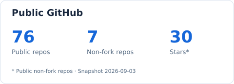
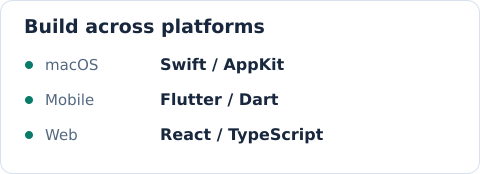
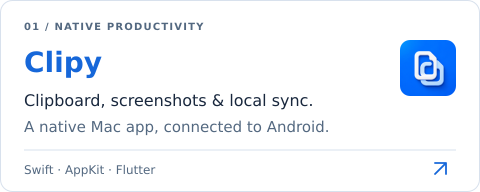
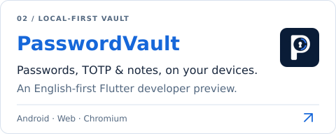

  <b>English</b> &nbsp; / &nbsp; <a href="./README.zh-CN.md" lang="zh-CN">简体中文</a>

  <picture>
    <source media="(prefers-color-scheme: dark)" srcset="./assets/header-dark.svg" />
    
  </picture>

  <b>Turning everyday friction into useful tools.</b> 
  Native experiences. Useful tools. Thoughtful details.

### About me

- 🛠️ I'm **Kim / JunWeiUp**, building apps for macOS, mobile, and the web.
- 📋 Currently refining **[Clipy](https://github.com/JunWeiUp/Clipy)**: clipboard history, screenshots, and local sync for everyday work.
- 🧩 I also work on **[Password Vault](https://github.com/JunWeiUp/PasswordVault-install)**, a local password and two-factor authentication manager.
- 💡 I care about **native experiences, cross-platform development, and local data**, with attention to the details that make tools easier to use.
- 💬 Let's talk about useful tools, product design, and open source: **[start a conversation](https://github.com/JunWeiUp/JunWeiUp/issues)**.

  <code>Swift</code> &nbsp; <code>AppKit</code> &nbsp; <code>Dart</code> &nbsp; <code>Flutter</code> &nbsp; <code>TypeScript</code> &nbsp; <code>React</code>

  <a href="https://github.com/JunWeiUp?tab=repositories">
    <picture>
      <source media="(prefers-color-scheme: dark)" srcset="./assets/stats-dark.svg" />
      
    </picture>
  </a>
  <picture>
    <source media="(prefers-color-scheme: dark)" srcset="./assets/toolbox-dark.svg" />
    
  </picture>

### Selected projects

  <a href="https://github.com/JunWeiUp/Clipy">
    <picture>
      <source media="(prefers-color-scheme: dark)" srcset="./assets/clipy-dark.svg" />
      
    </picture>
  </a>
  <a href="https://github.com/JunWeiUp/PasswordVault-install">
    <picture>
      <source media="(prefers-color-scheme: dark)" srcset="./assets/vault-dark.svg" />
      
    </picture>
  </a>

**[Download Clipy](https://github.com/JunWeiUp/Clipy/releases)** · **[Get Password Vault](https://github.com/JunWeiUp/PasswordVault-install)** · **[More projects →](https://github.com/JunWeiUp?tab=repositories)**

  
<b>A closer look at Clipy</b>

   
  
Press <kbd>⇧</kbd> <kbd>⌘</kbd> <kbd>F</kbd> to search your clipboard history. Filter by content type, source app, or date.

  

    
  

  
Built with Swift / AppKit on macOS and Flutter on mobile. Clipy also includes screenshot annotation, OCR, and local network sync. <a href="https://github.com/JunWeiUp/Clipy/blob/master/README.md">Explore the features and implementation →</a>

 

Love and Peace. &nbsp; Keep building. ↗

