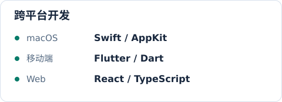
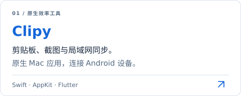
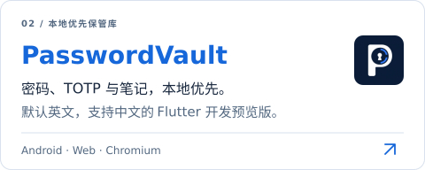

  <a href="https://github.com/JunWeiUp" lang="en">English</a> &nbsp; / &nbsp; <b>简体中文</b>

  <picture>
    <source media="(prefers-color-scheme: dark)" srcset="./assets/header-zh-CN-dark.svg" />
    
  </picture>

  <b>把日常的不顺手，做成顺手的工具。</b> 
  原生体验。实用工具。用心打磨的细节。

### 关于我

- 🛠️ 我是 **Kim / JunWeiUp**，开发 macOS、移动端和 Web 应用。
- 📋 最近在打磨 **[Clipy](https://github.com/JunWeiUp/Clipy)**：把剪贴板历史、截图与局域网同步融入日常工作。
- 🧩 我的项目还包括 **[PasswordVault](https://github.com/JunWeiUp/PasswordVault)**，一个管理密码、TOTP 与笔记的 Flutter 本地优先保管库，默认英文、支持中文，目前为开发预览版。
- 💡 关注**原生体验、跨平台开发与本地数据**，喜欢把功能和使用细节一起打磨。
- 💬 欢迎交流工具开发、产品体验与开源项目：**[在这里聊聊](https://github.com/JunWeiUp/JunWeiUp/issues)**。

  <code>Swift</code> &nbsp; <code>AppKit</code> &nbsp; <code>Dart</code> &nbsp; <code>Flutter</code> &nbsp; <code>TypeScript</code> &nbsp; <code>React</code>

  <picture>
    <source media="(prefers-color-scheme: dark)" srcset="./assets/capabilities-zh-CN-dark.svg" />
    
  </picture>
  <picture>
    <source media="(prefers-color-scheme: dark)" srcset="./assets/toolbox-zh-CN-dark.svg" />
    
  </picture>

### 精选项目

  <a href="https://github.com/JunWeiUp/Clipy">
    <picture>
      <source media="(prefers-color-scheme: dark)" srcset="./assets/clipy-zh-CN-dark.svg" />
      
    </picture>
  </a>
  <a href="https://github.com/JunWeiUp/PasswordVault">
    <picture>
      <source media="(prefers-color-scheme: dark)" srcset="./assets/vault-zh-CN-dark.svg" />
      
    </picture>
  </a>

**[下载 Clipy](https://github.com/JunWeiUp/Clipy/releases)** · **[PasswordVault 源码与预览](https://github.com/JunWeiUp/PasswordVault)** · **[更多项目 →](https://github.com/JunWeiUp?tab=repositories)**

  
<b>看一眼 Clipy</b>

   
  
按 <kbd>⇧</kbd> <kbd>⌘</kbd> <kbd>F</kbd> 搜索剪贴板历史，按内容类型、来源应用或时间筛选。

  

    
  

  
macOS 使用 Swift / AppKit，移动端使用 Flutter。项目同时包含截图标注、OCR 与局域网同步功能。<a href="https://github.com/JunWeiUp/Clipy/blob/master/README_ZH.md">查看功能与实现说明 →</a>

 

爱与和平。 &nbsp; 持续创造。 ↗

